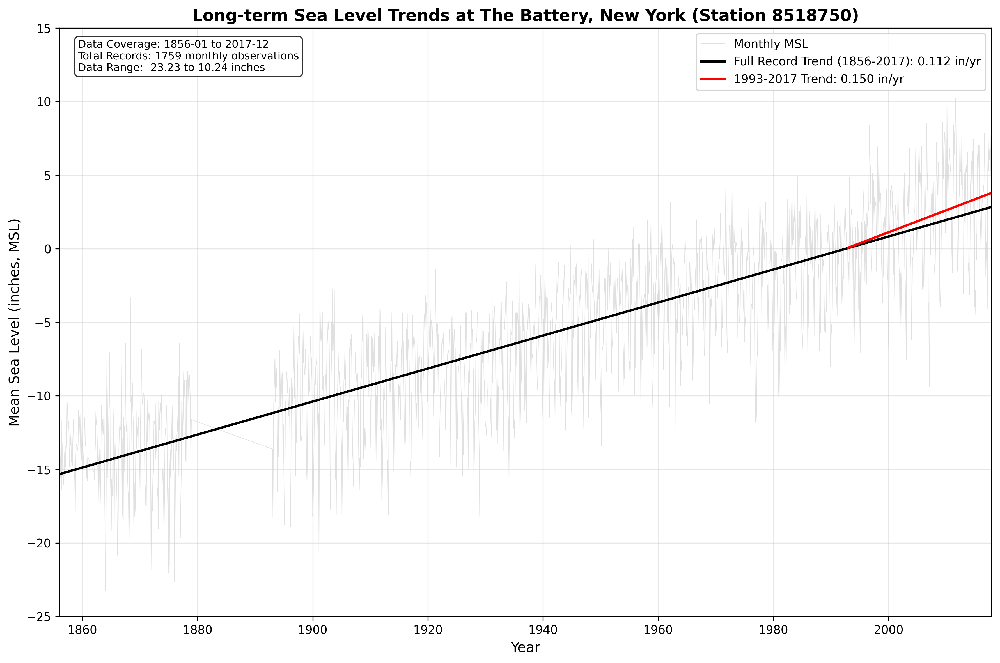
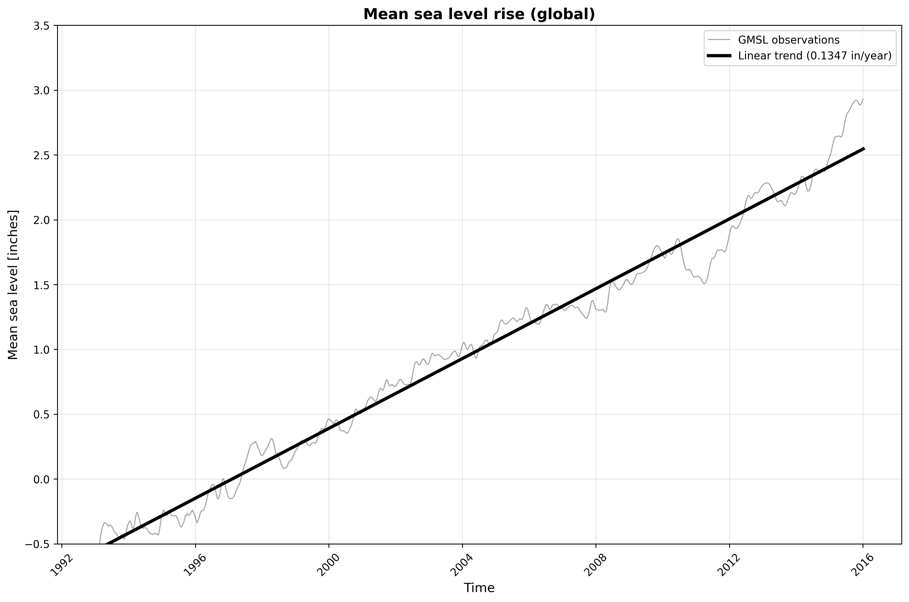
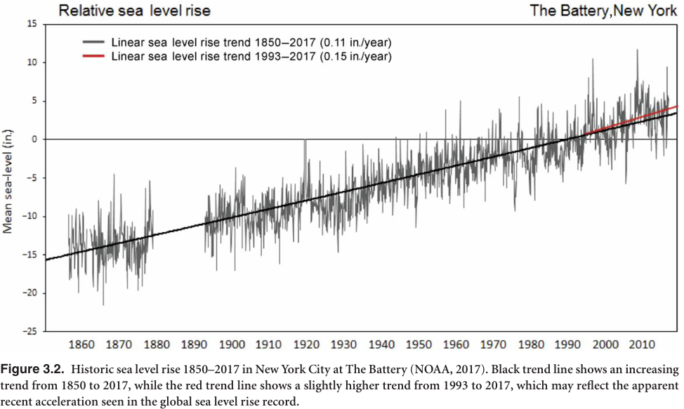
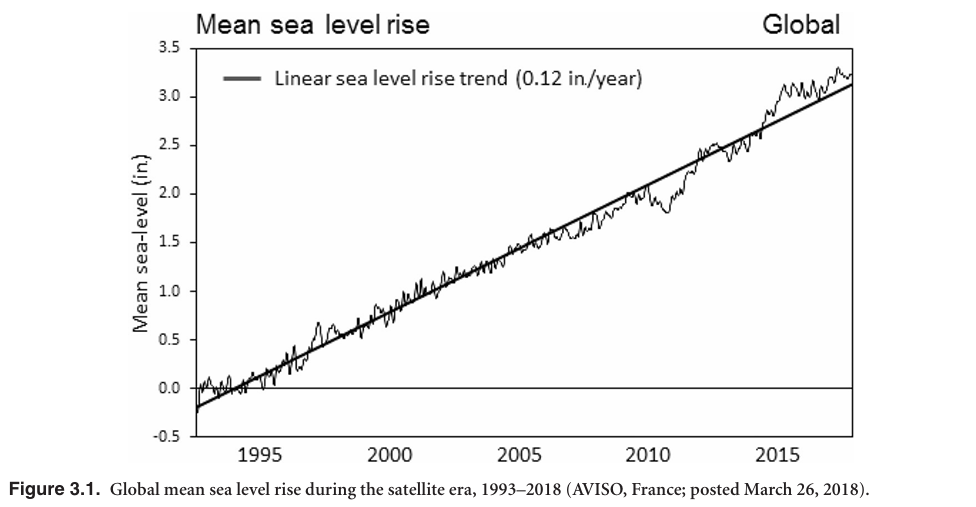
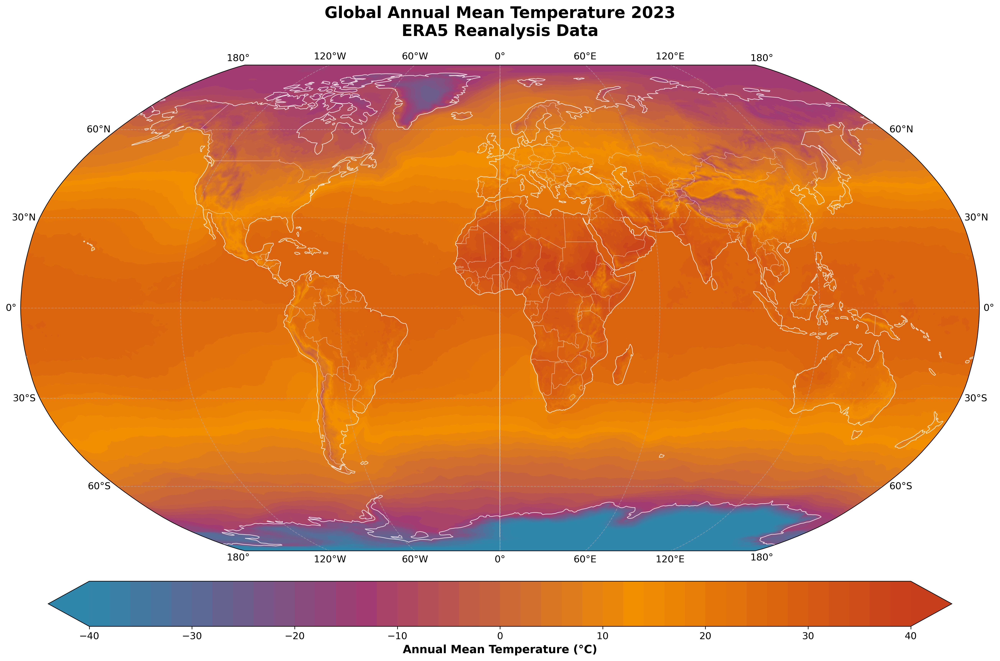
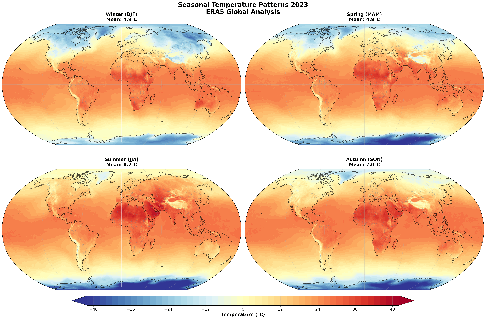

# AutoClimDS v2: Climate Data Science Agentic AI — A Knowledge Graph is All You Need

## Paper

- **arXiv:** https://arxiv.org/abs/2509.21553

This repository implements a proof-of-concept system for agentic AI workflows in climate data science powered by a knowledge graph (KG). The system integrates datasets from sources like NASA CMR, NOAA OneStop, ERA5, CMIP6, FloodNet, FloodSimBench, MRMS, and US City 311 Service Requests, enabling natural-language-driven data discovery, acquisition, and analysis.

> **Note:** This version (v2) extends the original [AutoClimDS](https://github.com/Ajaberr/AutoClimDS) with four additional data acquisition agents: **FloodNet**, **FloodSimBench**, **MRMS (Multi-Radar Multi-Sensor)**, and **US City 311 Service Requests** (NYC, Chicago, San Francisco, Austin). The orchestrator (`climate_research_orchestrator_new_V1.py`) and web interface (`app_new_streamlitv2.py`) are updated to route queries to these new agents. All other components are identical to the original repository.

## Abstract

Climate data science remains constrained by fragmented data sources, heterogeneous formats, and steep technical expertise requirements. These barriers slow discovery, limit participation, and undermine reproducibility. We present AutoClimDS, a proof of concept Agentic AI system that addresses these challenges by integrating a curated climate knowledge graph (KG) with a set of Agentic AI workflows designed for cloud-native scientific analysis. The KG unifies datasets, metadata, tools, and workflows into a machine-interpretable structure, while AI agents—powered by generative models—enable natural-language query interpretation, automated data discovery, programmatic data acquisition, and end-to-end climate analysis. A key result is that AutoClimDS can reproduce published scientific figures and analyses from natural-language instructions alone, completing the entire workflow from dataset selection to preprocessing to modeling. When given the same tasks, state-of-the-art general-purpose LLMs (e.g., ChatGPT GPT-5.1) cannot independently identify authoritative datasets or construct valid retrieval workflows using standard web access. This highlights the necessity of structured scientific memory for agentic scientific reasoning. By encoding procedural workflow knowledge into a KG and integrating it with existing technologies (cloud APIs, LLMs, sandboxed execution), AutoClimDS demonstrates that the KG serves as the essential enabling component—the irreplaceable structural foundation—for autonomous climate data science. This approach provides a pathway toward democratizing climate research through human–AI collaboration.

**Keywords:** Knowledge Graphs, AI Agents, Climate Data Science, Generative AI, Cloud-Native Data Access, Human–AI Collaboration

## Overview
Climate data science faces challenges like fragmented data, heterogeneous formats, and high expertise barriers. AutoClimDS addresses these by combining a curated KG (stored in AWS Neptune) with AI agents for autonomous workflows. The KG encodes procedural knowledge (e.g., access links, variable mappings, preprocessing steps), while agents handle discovery, acquisition, modeling, and verification. Key results include reproducing published figures (e.g., from NPCC4 reports) from natural-language prompts alone. This repo provides the code and setup instructions. **All data files (KG CSVs, climate metadata, ML predictions) are stored on S3 at `s3://autoclimds-simulation-kg/` for public read access** to reduce repository size.

The architecture (as shown in Fig. 1 of the paper) features a central Orchestrator Agent routing tasks to specialized agents: Data Discovery, Data Acquisition, Climate Modeling, and Verification. It uses LangChain for agentic loops, AWS Bedrock for LLM inference (Claude Sonnet 4), and Neptune for KG queries.

## Installation and Setup
To get started:
1. Clone this repository.
2. Install dependencies: `pip install -r Agents/requirements.txt` (includes LangChain, sentence-transformers, xarray, shapely, etc.).
3. Configure environment: Copy `Agents/env_example` to `Agents/.env` and fill in your credentials:
   - NASA Earthdata username/password
   - NOAA CDO token and email
   - AWS Access Key ID and Secret Access Key (required for Bedrock LLM and Neptune KG)
   - Neptune `GRAPH_ID`
   - (Optional) `SOCRATA_APP_TOKEN` for higher NYC 311 API rate limits
4. Set up AWS: Ensure access to Neptune Analytics, Bedrock (Claude Sonnet 4), and S3 for KG loading.
5. Load the KG: Follow the "What to Do with the CSVs" section below.
6. Run the web interface: `python3 -m streamlit run Agents/app_new_streamlitv2.py`
   - Or run demos via `Agents/AgenticAIPipeline.ipynb` or individual scripts.

Note: Requires Python 3.10+ and AWS credentials. For open-source alternatives, replace Bedrock with local LLMs (e.g., via Hugging Face) and Neptune with Neo4j.

## Directory Structure
The repository is structured as follows (rooted under `AutoClimDS/` on the `test` branch):

- **`Agents/`**: Core directory containing Python scripts for the AI agents, orchestrator, and demonstration notebook. This implements the multi-agent system described in Section II.B of the paper.
  - Key files:
    - `nasa_cmr_data_acquisition_agent.py`: Implements the Data Acquisition Agent (Section II.B.2). Handles retrieval from NASA CMR, AWS Open Data S3 buckets, and NOAA CDO API. Supports authentication, format standardization (e.g., NetCDF to tabular), and inline code execution for preprocessing/validation.
    - `cesm_lens_langchain_agent.py`: Handles CESM Large Ensemble (LENS) data (related to simulation agents in Section II.B.3). Loads data via Intake catalogs or Zarr on S3, computes ensemble statistics, and generates outputs like CSVs, Parquets, and figures.
    - `knowledge_graph_agent_bedrock.py`: Implements the Data Discovery Agent (Section II.B.1). Queries the KG in AWS Neptune for semantic search (vector + text-based), multi-criteria filtering (temporal, spatial, variable), and persists results in SQLite.
    - `cesm_verification_agent.py`: Implements validation logic (integrated across agents, e.g., Section II.B.4). Checks data quality, accessibility, and analytical consistency (e.g., V(ˆD) function for constraint enforcement).
    - `climate_research_orchestrator.py`: Central Orchestrator Agent (Section II.B.6). Interprets queries, routes to other agents using LangChain's StateGraph, manages state/errors, and compiles end-to-end workflows.
    - `climate_research_orchestrator_new_V1.py`: Updated orchestrator that includes routing to the four new agents below.
    - `AgenticAIPipeline.ipynb`: Jupyter notebook demonstrating full workflows (e.g., case studies from Section III). Run this to see agent interactions in action and generate outputs.
    - `app_new_streamlitv2.py`: Streamlit web interface for interacting with the orchestrator via browser. Run with `python3 -m streamlit run Agents/app_new_streamlitv2.py`.
    - `requirements.txt`: Lists dependencies (e.g., LangChain, sentence-transformers, xarray, shapely). Install via `pip install -r Agents/requirements.txt`.
    - `env_example`: Template for `.env` file. Copy to `.env` and add secrets (e.g., NASA Earthdata credentials, NOAA tokens, Neptune GRAPH_ID, AWS credentials).
    - **New agents added in v2:**
      - `floodnet_data_acquisition_agent.py`: Queries the FloodNet IoT sensor network (NYC DEP) for real-time and historical street-level flood depth measurements across NYC boroughs.
      - `floodsimbench_data_acquisition_agent.py`: Acquires FloodSimBench benchmark datasets from HuggingFace (chrimerss/FloodSimBench). Covers 10 US cities with 1-m DEM, water depth time series, and flood severity maps for 10/25/50/100-year storm events.
      - `mrms_data_acquisition_agent.py`: Downloads MRMS (Multi-Radar/Multi-Sensor System) radar and precipitation products from NOAA NSSL/NCEP. Supports QPE, reflectivity, hail (MESH), rotation, and lightning products in GRIB2 format at ~1 km / 2-min resolution over CONUS.
      - `us_city_311_data_acquisition_agent.py`: Queries 311 Service Request data from NYC, Chicago, San Francisco, and Austin via Socrata Open Data API. NYC queries use a dedicated v3 API endpoint with optional Socrata App Token for higher rate limits.
      - `load_new_datasets_to_sqlite.py`: Utility script to register the new v2 datasets into the local SQLite knowledge graph for discovery and routing.

- **`CMIP6Data/`**: Contains scripts and tools for ingesting and processing CMIP6 data (Section II.A). Includes API request scripts for metadata resolution via ESGF distributed index, DRS tuple filtering, and related utilities. Generated metadata JSONs are stored on S3 at `s3://autoclimds-simulation-kg/CMIP6Data/CMIP6Meta/`.

- **`ERA5Data/`**: Contains scripts for ERA5 data handling (Section II.A). Includes metadata scraper scripts for Copernicus CDS, web crawling, JSON normalization, and data discovery tools. Generated metadata JSONs are stored on S3 at `s3://autoclimds-simulation-kg/ERA5Data/ERA5Meta/`.

- **`KGNeptune/`**: Contains scripts and tools for building the KG (Section II.A). The actual CSV files (82 files, ~3 GB) are stored on S3 at `s3://autoclimds-simulation-kg/neptune_csvs/` and are **not** included in the repository. CSVs are in OpenCypher-compatible format derived from NASA CMR, NOAA OneStop, ERA5, and CMIP6. The `json_to_csvs.py` script automatically downloads source data from S3, generates CSVs, and uploads them back to S3.

- **`ML_Model/`**: Contains scripts and tools for the machine learning components (Section II.A). Includes fine-tuned ClimateBERT model scripts, training requirements, and utilities for semantic variable mapping and classification. ML predictions (67 MB) are stored on S3 at `s3://autoclimds-simulation-kg/MLModel/predictions/`.

- **`NasaCMRData/`**: Contains scripts for NASA CMR data retrieval and processing (Section II.A). Includes requirements and tools for API interactions, UMM-JSON parsing, and metadata handling. Source JSON files (~106K datasets), CESM variables (2,289 variables), and NOAA data are stored on S3 at `s3://autoclimds-simulation-kg/NasaCMRData/`.

- **Other Root Files**:
  - `.gitignore`: Specifies files to ignore in Git (e.g., .env, __pycache__, temporary files, S3-stored data directories).
  - `Documentation.txt`: Additional project documentation, including setup notes, flow descriptions, or high-level explanations.
  - `LICENSE`: The project's license file (e.g., MIT or Apache; check for specifics).

The code flow starts with the orchestrator (`Agents/climate_research_orchestrator.py`) parsing a user query, routing to discovery (`Agents/knowledge_graph_agent_bedrock.py`), acquisition (`Agents/nasa_cmr_data_acquisition_agent.py` or `Agents/cesm_lens_langchain_agent.py`), analysis/modeling, and verification (`Agents/cesm_verification_agent.py`). Agents interact via shared outputs (e.g., SQLite for metadata, files for data/figures). Inline code execution uses sandboxed environments with libraries like xarray, pandas, and matplotlib. Data ingestion scripts from `CMIP6Data/`, `ERA5Data/`, and `NasaCMRData/` feed into the KG construction in `KGNeptune/`, while `ML_Model/` handles variable mapping.

## How to Access Each Component of the Research Paper
This repo maps directly to the paper's sections for reproducibility:

- **Knowledge Graph Ontology and Construction (Section II.A)**: KG CSVs (~3 GB) are stored on S3 at `s3://autoclimds-simulation-kg/neptune_csvs/`. Load into Neptune as described below. The ingestion pipeline logic is in directories like `CMIP6Data/`, `ERA5Data/`, and `NasaCMRData/` (e.g., API scripts, vector embeddings via sentence-transformers, link scoring). Source metadata files are also on S3. ML components for variable mapping are in `ML_Model/` with predictions on S3.
  
- **AutoClimDS Agentic AI Architecture (Section II.B)**:
  - Data Discovery: `Agents/knowledge_graph_agent_bedrock.py` (vector search, multi-criteria queries).
  - Data Acquisition: `Agents/nasa_cmr_data_acquisition_agent.py` (retrieval protocols, dynamic discovery).
  - Climate Simulation Agents: `Agents/cesm_lens_langchain_agent.py` (ERA5/CMIP6 handling via cdsapi/ESGF).
  - State Management/Error Recovery: Integrated in orchestrator and agents (e.g., SQLite persistence, fallback loops).
  - Agentic Loop/Guardrails: Uses ReAct in LangChain (all agents).
  - Multi-Agent System: Orchestrated via `Agents/climate_research_orchestrator.py` (StateGraph for routing).

- **Cloud Deployment (Section II.C)**: Configured via `Agents/.env` (AWS credentials). Run agents/notebook after Neptune setup.

- **Case Studies (Section III)**:
  - Observational Data (Sea Level Trends): Run `Agents/AgenticAIPipeline.ipynb` with NPCC4 prompts; outputs generated during runtime (e.g., data files and figures saved in the current working directory).
  - Climate Simulation (Temperature Projections): Similar, using CMIP6/ERA5 queries in the notebook.

- **Open Science (Section IV)**: All code/scripts here; extend by adding KG entries or tools.

- **Conclusion/Limitations (Section V)**: See limitations below.

To access: Set up environment (see `Agents/requirements.txt` and `Agents/env_example`), load KG CSVs from `KGNeptune/` into Neptune, then run `Agents/AgenticAIPipeline.ipynb` or individual agents with prompts matching paper examples.

## What to Do with the CSVs

**Important:** All KG CSVs, climate data files (CMIP6/ERA5/NASA CMR/NOAA), ML predictions, and CESM variables are now stored on S3 at `s3://autoclimds-simulation-kg/` for public read access. These files are **not** included in the Git repository to reduce repo size.

### Accessing the Data

**Option 1: Use Pre-Loaded S3 Data (Recommended)**
The complete KG CSVs are available at `s3://autoclimds-simulation-kg/neptune_csvs/` with ~1.48M nodes and ~5.8M edges. To load into your Neptune instance:

1. **Prepare AWS**: Install AWS CLI, configure credentials (`aws configure`).

2. **Create Neptune Graph**: Use AWS Console or CLI to create a Neptune Analytics graph. Specify the S3 URI: `s3://autoclimds-simulation-kg/neptune_csvs/`. Use OpenCypher format.

3. **Configure**: Update `Agents/.env` with `GRAPH_ID` (from Neptune). The `Agents/knowledge_graph_agent_bedrock.py` will query it.

**Option 2: Generate CSVs Yourself**
To regenerate CSVs from source data (also stored on S3):

```bash
cd KGNeptune
python json_to_csvs.py --output-dir neptune_csvs
```

**Important: No AWS credentials or configuration required.** The script downloads all data from public S3 URLs using standard HTTPS requests. You only need Python 3.10+ and the packages in `KGNeptune/requirements.txt` (including `requests`). The `boto3` library is optional and only needed if you want to upload CSVs back to S3 (maintainers only).

The script automatically:
- Downloads source JSON files from public S3 URLs (NASA CMR, NOAA, CMIP6, ERA5)
- Loads CESM variables and ML predictions from public S3 URLs
- Generates Neptune CSV files locally
- Optionally uploads completed CSVs back to S3 (requires AWS credentials)

### S3 Data Structure

```
s3://autoclimds-simulation-kg/
├── neptune_csvs/           # Complete KG CSVs (82 files, ~3 GB)
├── CMIP6Data/CMIP6Meta/    # CMIP6 metadata JSONs
├── ERA5Data/ERA5Meta/      # ERA5 dataset metadata
├── NasaCMRData/
│   ├── json_files/         # NASA CMR structured data
│   ├── noaa_json/          # NOAA OneStop data
│   └── cesm_variables/     # CESM variable mappings (2,289 variables)
└── MLModel/predictions/    # ClimateBERT predictions (67 MB)
```

This enables semantic search (e.g., vector-enabled nodes like Variable, Location). Do not modify CSVs without understanding the schema (available in supplementary materials [20]).

## Graphs and Figures
All figures from the paper are reproduced or referenced here. Generated figures from case studies are saved during runs (e.g., via matplotlib in agents like `Agents/cesm_lens_langchain_agent.py`). Below are descriptions with citations; run `Agents/AgenticAIPipeline.ipynb` to generate them locally. The figures described in the paper's Section III (Case Studies) are **not pre-stored static files in the repository**. They are **generated dynamically at runtime** when executing the code, aligning with the paper's emphasis on reproducibility through agentic workflows.

Based on code examination in Agents/cesm_lens_langchain_agent.py, figures are generated using matplotlib.pyplot and saved with plt.savefig (e.g., plt.savefig('ensemble_analysis_polars.png', dpi=300, bbox_inches='tight'); plt.savefig('trend_analysis_polars.png', dpi=300, bbox_inches='tight'); plt.savefig('uncertainty_analysis_polars.png', dpi=300, bbox_inches='tight')) to the current working directory (no specific subfolder is used; paths are relative to os.getcwd()). Similarly, data outputs like CSVs (e.g., cesm_df.write_csv(f"cesm_{safe_var_name}_{start_year}_{end_year}_texas.csv")) and Parquet files are saved to the current directory. The Agents/AgenticAIPipeline.ipynb invokes these agents but does not directly save figures—saving happens within the agent logic. The repository structure does not include output folders, as outputs are runtime-generated and not committed.

- **Fig. 1: Multi-agent system architecture.**
  Shows the Orchestrator routing to Data Discovery, Data Acquisition, and Modeling & Analytics agents. Citation: Paper Section II.B.6. .png>)

- **Fig. 2: End-to-end AWS architecture with frontend (CloudFront, React, API Gateway, Cognito) and backend (Bedrock, Neptune, SageMaker) integration.**
  Illustrates cloud deployment. Citation: Paper Section II.C. .png>)

- **Fig. 3: AutoClimDS replicated NPCC4 sea level trends.**
  Replicates Battery Park and global sea level trends (e.g., 0.112 in/yr long-term). Citation: Paper Section III.A; based on [25] (NPCC4). (Path: Battery Park - , Global Mean Sea Level - )

- **Fig. 4: Original figures from [25] (CC BY-NC license).**
  Original NPCC4 sea level plots for comparison. Citation: [25]. (Path: Battery Park - , Global Mean Sea Level - )

- **Fig. 5: Sea level trends with VLM-driven SLR: AutoClimDS (left) vs. Original [25] (right).**
  Compares Vertical Land Motion contributions (-1.5 mm/yr). Citation: Paper Section III.A; [25]. (AutoClimDS - , Original [25] - .png>))

- **Fig. 6: CMIP6/ERA5 temperature analysis for NYC: historical reanalysis and multi-model SSP2-4.5 projections with ensemble uncertainty.**
  Shows temperature projections (e.g., ensemble means). Citation: Paper Section III.B. (Global Annual - , Seasonal Patterns - )

These figures demonstrate reproducibility (e.g., JSD=0 for exact matches). Citations reference the paper and [25] (NPCC4 report).

## Limitations
As a proof-of-concept (paper Section V):
- **API Instability**: Reliance on external APIs (NASA Earthdata, NOAA CDO, ESGF) can fail due to rate limits, downtime, or changes (e.g., 5 req/s for NOAA).
- **Incomplete Metadata/KG Coverage**: KG has ~208,000 datasets but partial procedural knowledge; may miss niche sources or require manual additions via scripts in `KGNeptune/`.
- **LLM Hallucinations**: Without KG, baselines like GPT-5.1 fail (Section I.B); even with it, complex queries may need refinements.
- **Scalability**: Max iterations (15-100) and timeouts (300s) prevent loops but limit very long workflows. Resource quotas in sandboxed execution.
- **Partial Automation**: Dynamic discovery helps, but unseen sources may require human intervention. Limited to observational/simulation data; no real-time ingestion.
- **Cloud Dependency**: Requires AWS (Neptune, Bedrock); open-source alternatives (Neo4j, Llama) possible but not implemented.
- **Ethical/Access**: Assumes user has credentials; no handling for restricted data beyond tokens.
- **Figure Generation**: Figures are runtime-generated, so initial repo may lack them; must run code to populate the working directory.

For contributions, extend agents or KG CSVs. See paper for broader socio-technical implications.

## Contributing
Contributions are welcome! Fork the repo, make changes (e.g., add new data sources to `KGNeptune/` or agents), and submit a pull request. Follow the code style in existing scripts. For issues, use GitHub Issues.

## License
See `LICENSE` for details (e.g., MIT License).

## Acknowledgments
Thanks to the open-source communities behind LangChain, AWS, and climate data providers (NASA, NOAA, Copernicus). This work builds on prior efforts like LinkClimate [19] and ClimateBERT [9].

[24] Amazon Web Services. (2025) Amazon Neptune Analytics User Guide. [Online]. Available: https://docs.aws.amazon.com/neptune-analytics/latest/userguide/what-is-neptune-analytics.html

[25] C. Braneon, L. Ortiz, D. Bader, N. Devineni, P. Orton, B. Rosenzweig, T. McPhearson, L. Smalls-Mantey, V. Gornitz, T. Mayo, S. Kadam, H. Sheerazi, E. Glenn, L. Yoon, A. Derras-Chouk, J. Towers, R. Leichenko, D. Balk, P. Marcotullio, and R. Horton, “NPCC4: New York City climate risk information 2022—observations and projections,” Annals of the New York Academy of Sciences, vol. 1539, no. 1, pp. 13–48, 2024.
