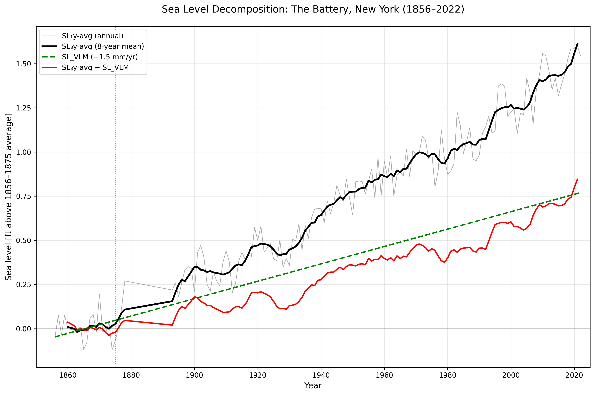

# AutoClimDS: Climate Data Science Agentic AI — A Knowledge Graph is All You Need

This repository implements a proof-of-concept system for agentic AI workflows in climate data science powered by a knowledge graph (KG). The system integrates datasets from sources like NASA CMR, NOAA OneStop, ERA5, and CMIP6, enabling natural-language-driven data discovery, acquisition, and analysis.

## Abstract

Climate data science remains constrained by fragmented data sources, heterogeneous formats, and steep technical expertise requirements. These barriers slow discovery, limit participation, and undermine reproducibility. We present AutoClimDS, a proof of concept Agentic AI system that addresses these challenges by integrating a curated climate knowledge graph (KG) with a set of Agentic AI workflows designed for cloud-native scientific analysis. The KG unifies datasets, metadata, tools, and workflows into a machine-interpretable structure, while AI agents—powered by generative models—enable natural-language query interpretation, automated data discovery, programmatic data acquisition, and end-to-end climate analysis. A key result is that AutoClimDS can reproduce published scientific figures and analyses from natural-language instructions alone, completing the entire workflow from dataset selection to preprocessing to modeling. When given the same tasks, state-of-the-art general-purpose LLMs (e.g., ChatGPT GPT-5.1) cannot independently identify authoritative datasets or construct valid retrieval workflows using standard web access. This highlights the necessity of structured scientific memory for agentic scientific reasoning. By encoding procedural workflow knowledge into a KG and integrating it with existing technologies (cloud APIs, LLMs, sandboxed execution), AutoClimDS demonstrates that the KG serves as the essential enabling component—the irreplaceable structural foundation—for autonomous climate data science. This approach provides a pathway toward democratizing climate research through human–AI collaboration.

**Keywords:** Knowledge Graphs, AI Agents, Climate Data Science, Generative AI, Cloud-Native Data Access, Human–AI Collaboration

## Overview
Climate data science faces challenges like fragmented data, heterogeneous formats, and high expertise barriers. AutoClimDS addresses these by combining a curated KG (stored in AWS Neptune) with AI agents for autonomous workflows. The KG encodes procedural knowledge (e.g., access links, variable mappings, preprocessing steps), while agents handle discovery, acquisition, modeling, and verification. Key results include reproducing published figures (e.g., from NPCC4 reports) from natural-language prompts alone. This repo provides the code and setup instructions. **All data files (KG CSVs, climate metadata, ML predictions) are stored on S3 at `s3://autoclimds-simulation-kg/` for public read access** to reduce repository size.

The architecture (as shown in Fig. 1 of the paper) features a central Orchestrator Agent routing tasks to specialized agents: Data Discovery, Data Acquisition, Climate Modeling, and Verification. It uses LangChain for agentic loops, AWS Bedrock for LLM inference (Claude Sonnet 4), and Neptune for KG queries.

## Installation and Setup
To get started:
1. Clone the repository: `git clone https://github.com/Ajaberr/AutoClimDS.git && cd AutoClimDS && git checkout test`.
2. Install dependencies: `pip install -r Agents/requirements.txt` (includes LangChain, sentence-transformers, xarray, shapely, etc.).
3. Configure environment: Copy `Agents/env_example` to `Agents/.env` and fill in secrets (e.g., NASA Earthdata credentials, NOAA tokens, Neptune GRAPH_ID, Bedrock details).
4. Set up AWS: Ensure access to Neptune Analytics, Bedrock, and S3 for KG loading.
5. Load the KG: Follow the "What to Do with the CSVs" section below.
6. Run demos: Execute `Agents/AgenticAIPipeline.ipynb` for workflows or individual scripts like `Agents/climate_research_orchestrator.py`.

Note: Requires Python 3.10+ and AWS credentials. For open-source alternatives, replace Bedrock with local LLMs (e.g., via Hugging Face) and Neptune with Neo4j.

## Directory Structure
The repository is structured as follows (rooted under `AutoClimDS/` on the `test` branch):

- **`Agents/`**: Core directory containing Python scripts for the AI agents, orchestrator, and demonstration notebook. This implements the multi-agent system described in Section II.B of the paper.
  - Key files:
    - `nasa_cmr_data_acquisition_agent.py`: Implements the Data Acquisition Agent (Section II.B.2). Handles retrieval from NASA CMR, AWS Open Data S3 buckets, and NOAA CDO API. Supports authentication, format standardization (e.g., NetCDF to tabular), and inline code execution for preprocessing/validation.
    - `cesm_lens_langchain_agent.py`: Handles CESM Large Ensemble (LENS) data (related to simulation agents in Section II.B.3). Loads data via Intake catalogs or Zarr on S3, computes ensemble statistics, and generates outputs like CSVs, Parquets, and figures.
    - `knowledge_graph_agent_bedrock.py`: Implements the Data Discovery Agent (Section II.B.1). Queries the KG in AWS Neptune for semantic search (vector + text-based), multi-criteria filtering (temporal, spatial, variable), and persists results in SQLite.
    - `cesm_verification_agent.py`: Implements validation logic (integrated across agents, e.g., Section II.B.4). Checks data quality, accessibility, and analytical consistency (e.g., V(ˆD) function for constraint enforcement).
    - `climate_research_orchestrator.py`: Central Orchestrator Agent (Section II.B.6). Interprets queries, routes to other agents using LangChain's StateGraph, manages state/errors, and compiles end-to-end workflows.
    - `AgenticAIPipeline.ipynb`: Jupyter notebook demonstrating full workflows (e.g., case studies from Section III). Run this to see agent interactions in action and generate outputs.
    - `requirements.txt`: Lists dependencies (e.g., LangChain, sentence-transformers, xarray, shapely). Install via `pip install -r Agents/requirements.txt`.
    - `env_example`: Template for `.env` file. Copy to `.env` and add secrets (e.g., NASA Earthdata credentials, NOAA tokens, Neptune GRAPH_ID).
    - `README.md`: Internal documentation for the agents directory, including quick start and agent details.

- **`CMIP6Data/`**: Contains scripts and tools for ingesting and processing CMIP6 data (Section II.A). Includes API request scripts for metadata resolution via ESGF distributed index, DRS tuple filtering, and related utilities. Generated metadata JSONs are stored on S3 at `s3://autoclimds-simulation-kg/CMIP6Data/CMIP6Meta/`.

- **`ERA5Data/`**: Contains scripts for ERA5 data handling (Section II.A). Includes metadata scraper scripts for Copernicus CDS, web crawling, JSON normalization, and data discovery tools. Generated metadata JSONs are stored on S3 at `s3://autoclimds-simulation-kg/ERA5Data/ERA5Meta/`.

- **`KGNeptune/`**: Contains scripts and tools for building the KG (Section II.A). The actual CSV files (82 files, ~3 GB) are stored on S3 at `s3://autoclimds-simulation-kg/neptune_csvs/` and are **not** included in the repository. CSVs are in OpenCypher-compatible format derived from NASA CMR, NOAA OneStop, ERA5, and CMIP6. The `json_to_csvs.py` script automatically downloads source data from S3, generates CSVs, and uploads them back to S3.

- **`ML_Model/`**: Contains scripts and tools for the machine learning components (Section II.A). Includes fine-tuned ClimateBERT model scripts, training requirements, and utilities for semantic variable mapping and classification. ML predictions (67 MB) are stored on S3 at `s3://autoclimds-simulation-kg/MLModel/predictions/`.

- **`NasaCMRData/`**: Contains scripts for NASA CMR data retrieval and processing (Section II.A). Includes requirements and tools for API interactions, UMM-JSON parsing, and metadata handling. Source JSON files (~106K datasets), CESM variables (2,289 variables), and NOAA data are stored on S3 at `s3://autoclimds-simulation-kg/NasaCMRData/`.

- **Other Root Files**:
  - `.gitignore`: Specifies files to ignore in Git (e.g., .env, __pycache__, temporary files, S3-stored data directories).
  - `Documentation.txt`: Additional project documentation, including setup notes, flow descriptions, or high-level explanations.
  - `LICENSE`: The project's license file (e.g., MIT or Apache; check for specifics).

The code flow starts with the orchestrator (`Agents/climate_research_orchestrator.py`) parsing a user query, routing to discovery (`Agents/knowledge_graph_agent_bedrock.py`), acquisition (`Agents/nasa_cmr_data_acquisition_agent.py` or `Agents/cesm_lens_langchain_agent.py`), analysis/modeling, and verification (`Agents/cesm_verification_agent.py`). Agents interact via shared outputs (e.g., SQLite for metadata, files for data/figures). Inline code execution uses sandboxed environments with libraries like xarray, pandas, and matplotlib. Data ingestion scripts from `CMIP6Data/`, `ERA5Data/`, and `NasaCMRData/` feed into the KG construction in `KGNeptune/`, while `ML_Model/` handles variable mapping.

## How to Access Each Component of the Research Paper
This repo maps directly to the paper's sections for reproducibility:

- **Knowledge Graph Ontology and Construction (Section II.A)**: KG CSVs (~3 GB) are stored on S3 at `s3://autoclimds-simulation-kg/neptune_csvs/`. Load into Neptune as described below. The ingestion pipeline logic is in directories like `CMIP6Data/`, `ERA5Data/`, and `NasaCMRData/` (e.g., API scripts, vector embeddings via sentence-transformers, link scoring). Source metadata files are also on S3. ML components for variable mapping are in `ML_Model/` with predictions on S3.
  
- **AutoClimDS Agentic AI Architecture (Section II.B)**:
  - Data Discovery: `Agents/knowledge_graph_agent_bedrock.py` (vector search, multi-criteria queries).
  - Data Acquisition: `Agents/nasa_cmr_data_acquisition_agent.py` (retrieval protocols, dynamic discovery).
  - Climate Simulation Agents: `Agents/cesm_lens_langchain_agent.py` (ERA5/CMIP6 handling via cdsapi/ESGF).
  - State Management/Error Recovery: Integrated in orchestrator and agents (e.g., SQLite persistence, fallback loops).
  - Agentic Loop/Guardrails: Uses ReAct in LangChain (all agents).
  - Multi-Agent System: Orchestrated via `Agents/climate_research_orchestrator.py` (StateGraph for routing).

- **Cloud Deployment (Section II.C)**: Configured via `Agents/.env` (AWS credentials). Run agents/notebook after Neptune setup.

- **Case Studies (Section III)**:
  - Observational Data (Sea Level Trends): Run `Agents/AgenticAIPipeline.ipynb` with NPCC4 prompts; outputs generated during runtime (e.g., data files and figures saved in the current working directory).
  - Climate Simulation (Temperature Projections): Similar, using CMIP6/ERA5 queries in the notebook.

- **Open Science (Section IV)**: All code/scripts here; extend by adding KG entries or tools.

- **Conclusion/Limitations (Section V)**: See limitations below.

To access: Set up environment (see `Agents/requirements.txt` and `Agents/env_example`), load KG CSVs from `KGNeptune/` into Neptune, then run `Agents/AgenticAIPipeline.ipynb` or individual agents with prompts matching paper examples.

## What to Do with the CSVs

**Important:** All KG CSVs, climate data files (CMIP6/ERA5/NASA CMR/NOAA), ML predictions, and CESM variables are now stored on S3 at `s3://autoclimds-simulation-kg/` for public read access. These files are **not** included in the Git repository to reduce repo size.

### Accessing the Data

**Option 1: Use Pre-Loaded S3 Data (Recommended)**
The complete KG CSVs are available at `s3://autoclimds-simulation-kg/neptune_csvs/` with ~1.48M nodes and ~5.8M edges. To load into your Neptune instance:

1. **Prepare AWS**: Install AWS CLI, configure credentials (`aws configure`).

2. **Create Neptune Graph**: Use AWS Console or CLI to create a Neptune Analytics graph. Specify the S3 URI: `s3://autoclimds-simulation-kg/neptune_csvs/`. Use OpenCypher format.

3. **Configure**: Update `Agents/.env` with `GRAPH_ID` (from Neptune). The `Agents/knowledge_graph_agent_bedrock.py` will query it.

**Option 2: Generate CSVs Yourself**
To regenerate CSVs from source data (also stored on S3):

```bash
cd KGNeptune
python json_to_csvs.py --output-dir neptune_csvs
```

**Important: No AWS credentials or configuration required.** The script downloads all data from public S3 URLs using standard HTTPS requests. You only need Python 3.10+ and the packages in `KGNeptune/requirements.txt` (including `requests`). The `boto3` library is optional and only needed if you want to upload CSVs back to S3 (maintainers only).

The script automatically:
- Downloads source JSON files from public S3 URLs (NASA CMR, NOAA, CMIP6, ERA5)
- Loads CESM variables and ML predictions from public S3 URLs
- Generates Neptune CSV files locally
- Optionally uploads completed CSVs back to S3 (requires AWS credentials)

### S3 Data Structure

```
s3://autoclimds-simulation-kg/
├── neptune_csvs/           # Complete KG CSVs (82 files, ~3 GB)
├── CMIP6Data/CMIP6Meta/    # CMIP6 metadata JSONs
├── ERA5Data/ERA5Meta/      # ERA5 dataset metadata
├── NasaCMRData/
│   ├── json_files/         # NASA CMR structured data
│   ├── noaa_json/          # NOAA OneStop data
│   └── cesm_variables/     # CESM variable mappings (2,289 variables)
└── MLModel/predictions/    # ClimateBERT predictions (67 MB)
```

This enables semantic search (e.g., vector-enabled nodes like Variable, Location). Do not modify CSVs without understanding the schema (available in supplementary materials [20]).

## Graphs and Figures
All figures from the paper are reproduced or referenced here. Generated figures from case studies are saved during runs (e.g., via matplotlib in agents like `Agents/cesm_lens_langchain_agent.py`). Below are descriptions with citations; run `Agents/AgenticAIPipeline.ipynb` to generate them locally. The figures described in the paper's Section III (Case Studies) are **not pre-stored static files in the repository**. They are **generated dynamically at runtime** when executing the code, aligning with the paper's emphasis on reproducibility through agentic workflows.

Based on code examination in Agents/cesm_lens_langchain_agent.py, figures are generated using matplotlib.pyplot and saved with plt.savefig (e.g., plt.savefig('ensemble_analysis_polars.png', dpi=300, bbox_inches='tight'); plt.savefig('trend_analysis_polars.png', dpi=300, bbox_inches='tight'); plt.savefig('uncertainty_analysis_polars.png', dpi=300, bbox_inches='tight')) to the current working directory (no specific subfolder is used; paths are relative to os.getcwd()). Similarly, data outputs like CSVs (e.g., cesm_df.write_csv(f"cesm_{safe_var_name}_{start_year}_{end_year}_texas.csv")) and Parquet files are saved to the current directory. The Agents/AgenticAIPipeline.ipynb invokes these agents but does not directly save figures—saving happens within the agent logic. The repository structure does not include output folders, as outputs are runtime-generated and not committed.

- **Fig. 1: Multi-agent system architecture.**
  Shows the Orchestrator routing to Data Discovery, Data Acquisition, and Modeling & Analytics agents. Citation: Paper Section II.B.6. .png>)

- **Fig. 2: End-to-end AWS architecture with frontend (CloudFront, React, API Gateway, Cognito) and backend (Bedrock, Neptune, SageMaker) integration.**
  Illustrates cloud deployment. Citation: Paper Section II.C. .png>)

- **Fig. 3: AutoClimDS replicated NPCC4 sea level trends.**
  Replicates Battery Park and global sea level trends (e.g., 0.112 in/yr long-term). Citation: Paper Section III.A; based on [25] (NPCC4). (Path: Battery Park - , Global Mean Sea Level - )

- **Fig. 4: Original figures from [25] (CC BY-NC license).**
  Original NPCC4 sea level plots for comparison. Citation: [25]. (Path: Battery Park - , Global Mean Sea Level - )

- **Fig. 5: Sea level trends with VLM-driven SLR: AutoClimDS (left) vs. Original [25] (right).**
  Compares Vertical Land Motion contributions (-1.5 mm/yr). Citation: Paper Section III.A; [25]. (AutoClimDS - , Original [25] - .png>))

- **Fig. 6: CMIP6/ERA5 temperature analysis for NYC: historical reanalysis and multi-model SSP2-4.5 projections with ensemble uncertainty.**
  Shows temperature projections (e.g., ensemble means). Citation: Paper Section III.B. (Global Annual - , Seasonal Patterns - )

These figures demonstrate reproducibility (e.g., JSD=0 for exact matches). Citations reference the paper and [25] (NPCC4 report).

## Limitations
As a proof-of-concept (paper Section V):
- **API Instability**: Reliance on external APIs (NASA Earthdata, NOAA CDO, ESGF) can fail due to rate limits, downtime, or changes (e.g., 5 req/s for NOAA).
- **Incomplete Metadata/KG Coverage**: KG has ~208,000 datasets but partial procedural knowledge; may miss niche sources or require manual additions via scripts in `KGNeptune/`.
- **LLM Hallucinations**: Without KG, baselines like GPT-5.1 fail (Section I.B); even with it, complex queries may need refinements.
- **Scalability**: Max iterations (15-100) and timeouts (300s) prevent loops but limit very long workflows. Resource quotas in sandboxed execution.
- **Partial Automation**: Dynamic discovery helps, but unseen sources may require human intervention. Limited to observational/simulation data; no real-time ingestion.
- **Cloud Dependency**: Requires AWS (Neptune, Bedrock); open-source alternatives (Neo4j, Llama) possible but not implemented.
- **Ethical/Access**: Assumes user has credentials; no handling for restricted data beyond tokens.
- **Figure Generation**: Figures are runtime-generated, so initial repo may lack them; must run code to populate the working directory.

For contributions, extend agents or KG CSVs. See paper for broader socio-technical implications.

## Contributing
Contributions are welcome! Fork the repo, make changes (e.g., add new data sources to `KGNeptune/` or agents), and submit a pull request. Follow the code style in existing scripts. For issues, use GitHub Issues.

## License
See `LICENSE` for details (e.g., MIT License).

## Acknowledgments
Thanks to the open-source communities behind LangChain, AWS, and climate data providers (NASA, NOAA, Copernicus). This work builds on prior efforts like LinkClimate [19] and ClimateBERT [9].

## I. INTRODUCTION

Climate research investigates Earth’s climate systems, variability, and change effects on natural and human environments [1], drawing from observational datasets, simulation outputs, and analytical tools across domains [2]. Despite data proliferation, research remains fragmented: datasets in heterogeneous formats with inconsistent metadata lack standardized access [3]. Existing retrieval systems rely on keyword search requiring users to know dataset names [4], while general-purpose LLMs lack the structured scientific memory needed for autonomous data acquisition and workflow construction.

**Contributions:** We introduce a semantic infrastructure encoding climate data entities into a unified, queryable knowledge graph (KG) serving as structured scientific memory for agentic workflows. First, we present an ontology-driven methodology integrating NASA CMR, NOAA OneStop [5], ERA5 [6], CMIP6 [7] records into a semantically consistent graph using OpenCypher [8]. Unlike prior KGs providing conceptual vocabularies or keyword-driven retrieval, this approach encodes procedural workflow knowledge: executable access links with authentication protocols, variable-level semantic mappings via fine-tuned Climate-BERT [9] (99.17% accuracy), geospatial relationships, and preprocessing operation metadata. Second, we demonstrate this KG as reasoning substrate for AutoClimDS, reproducing scientific workflows end-to-end where existing approaches fail. The KG provides essential structural constraints—typed relationships like hasLink, hasCESMVariable, spatial containment—irreplaceable by pure vector search or LLM reasoning, evidenced by successful replication of published climate studies (Section III).

### A. Agentic AI and Human–AI Collaboration

Agentic AI systems [10] capable of autonomous reasoning, planning, and tool use offer promising solutions. Evidence shows generative AI assistants boost productivity 14% on average, with greatest gains for less-experienced users [11], narrowing expertise gaps in complex tasks. In climate data science, where bottlenecks stem from technical barriers, knowledge-graph-enabled Agentic AI could elevate entry-level researchers while streamlining expert workflows, making discovery more inclusive and reproducible.

### B. Related Work

Several initiatives have sought to improve climate data access and interoperability. Foundational projects like NASA Earthdata [12], CMIP [13], and ESGF [14] provide observational and model datasets. Computational tools such as Pangeo [15] and ESMValTool [16] facilitate cloud-based analysis, while ontologies like SWEET [17] and GeoLink [18] offer structured vocabularies for Earth science concepts. However, these were designed for human researchers: SWEET provides conceptual hierarchies (e.g., ”Precipitation” ⊆”AtmosphericPhenomenon”) but lacks executable data access paths; Pangeo requires manual dataset specification; ESMValTool demands expert-configured recipes. None capture the procedural reasoning needed for autonomous agentic workflows—how to authenticate with NASA Earthdata, which variable to extract from multi-dimensional NetCDF, or which preprocessing operations to apply for specific analyses.

Recent efforts such as LinkClimate [19] demonstrated knowledge graph infrastructures for climate datasets. However, its design reflects a static view where discovery is keyword-driven, treating datasets as retrieval endpoints without representing procedural knowledge or scientific reasoning needed for workflow construction. When tasked with reproducing the NPCC4 sea level analyses (Section III), LinkClimate’s keyword search returned dataset titles but relied on exact string matching over relatively shallow metadata fields. Similarly, GPT-5.1 with web search but without KG guidance failed to autonomously locate authoritative datasets, instead hallucinating dataset names or selecting inappropriate sources with mismatched temporal/spatial coverage. This reveals a critical gap: the lack of infrastructure serving as reasoning backbone for Agentic AI. This work addresses this gap by developing a knowledge graph encoding not just data locations but procedural reasoning paths, demonstrating that structured scientific memory enables reliable agentic workflows where pure retrieval or LLM reasoning alone fails.

## II. METHOD

### A. Knowledge Graph Ontology and Construction

The knowledge graph integrates metadata from NASA CMR, NOAA OneStop [5], ERA5 [6], and CMIP6 [7] via respective APIs. The graph contains |V| ≈1,300,000 nodes across 42 types and |E| ≈3,600,000 edges across 45 relationship types, encompassing ∼208,000 climate datasets (106,000 observational, 102,000 simulation outputs). The schema partitions into two branches: observational data (NASA CMR/NOAA OneStop capturing measurements, satellite retrievals, reanalysis) and simulation data (CMIP6/ERA5 encoding experiments, ensembles, model outputs). This hybrid design encodes both data content and procedural context.

**Data ingestion pipeline:** NASA CMR collections/granules retrieved via Search API (cmr.earthdata.nasa.gov) with UMM-JSON parsing for temporal/geospatial metadata. NOAA OneStop (data.noaa.gov/onestop) integrates NCEI, ERDDAP, CO-OPS repositories with 5 req/s rate limiting. ERA5 datasets discovered via Copernicus CDS web crawling (cds.climate.copernicus.eu) with HTML parsing and JSON normalization. CMIP6 metadata resolves via ESGF distributed index API with 10-field DRS tuple filtering (mip era, activity id, institution id, source id, experiment id, variant label, table id, variable id, grid label, version) and multi-node failover.

**Geospatial processing:** Polygon coordinates from dataset metadata undergo Shapely geometric processing for bounding box extraction. Mapbox Geocoding API classifies spatial scope hierarchically: ocean, global, continental, country, multinational, or regional across 258 location boundaries. This enables spatial relationship traversal via hasLocation edges during multi-criteria search.

**Link scoring and validation:** URLs undergo automated downloadability assessment. Domain analysis identifies API types (OpenDAP, ERDDAP, WMS, WFS, REST) and authentication requirements (public vs. restricted access). Downloadability weights reflect empirical retrieval success: direct protocols (HTTP/HTTPS/FTP, w = 1.0), scientific services (OPeNDAP/THREDDS, w = 0.8), web service APIs (w = 0.6), documentation (w = 0.4). Endpoint verification tests validate data accessibility before graph ingestion.

**Semantic variable mapping:** We fine-tuned ClimateBERT [9] 1 for multi-class classification over 2,308 CESM variables. Architecture employs attention-masked mean pooling with dropout (p = 0.3), trained via cross-entropy loss with Adam optimizer (α = 1 × 10−5, batch 16, 50 epochs) on curated CESM training set. Similarity-based clustering addresses variable redundancy via S(desc(vi), desc(vj)) ≥0.7, achieving Aexact = 93.45% and Agroup = 99.87%. The trained model maps observational dataset variables to standardized CESM nomenclature, enabling cross-dataset variable discovery.

**OpenCypher graph construction:** JSON metadata converts to Neptune-compatible OpenCypher CSV format via schema-driven transformation. Node types partition into core entities and climate-simulation specific types. Relationships encode typed edges with source-target node constraints. Embeddings for vector-enabled nodes are generated via sentence-transformers. The complete schema with node/edge definitions is available in the supplementary materials [20].

### B. AutoClimDS Agentic AI Architecture

The system implements three core objectives: Data Discovery, Data Acquisition, and Climate Modeling/Analytics. Implementation uses LangChain [21] with ReAct reasoning [22] and Bedrock Claude Sonnet 4 [23].

#### 1) Data Discovery Agent

The agent implements semantic dataset discovery by encoding research queries into 384-dimensional vectors through sentence-transformers. Vector search operates through Neptune Analytics’ topKByEmbedding() procedure implementing hierarchical navigable small world graphs for efficient approximate nearest neighbor retrieval [24].

The agent implements intelligent search routing through embedding availability detection, categorizing node types into vector-enabled and text-only categories. Vector-enabled types include DataCategory, Variable, CESMVariable, ScienceKeyword, Location, TemporalResolution, and SpatialResolution, while remaining nodes utilize text-based Neptune query matching.

Multi-criteria search extends single-criterion functionality by combining vector results with relationship-based filtering addressing real-world complexity where researchers must consider temporal coverage, spatial resolution, variable availability, and institutional provenance simultaneously. The algorithm constructs complex OpenCypher queries incorporating vector results as node constraints while applying additional filtering through temporal overlap detection [tstart, tend], spatial relationship traversal via hasLocation relationships, and other edges. This hybrid approach enables queries like ”precipitation datasets over Pacific Northwest from 1980-2020 with daily resolution” to leverage vector search for ”precipitation” while applying structured filters for location, temporal range, and resolution metadata.

Retrieved datasets undergo link reranking for automated prioritization: for dataset D with links LD = {l1, . . . , ln}, each link li possesses preprocessed weight wi ∈[0, 1] assigned during graph construction. The reranking function orders by descending weight via permutation σ: lσ(1), . . . , lσ(n) where wσ(1) ≥· · · ≥wσ(n). This prioritization ensures direct download protocols (HTTP/HTTPS/FTP, w = 1.0) are attempted before specialized scientific data services (OPeNDAP/THREDDS, w = 0.8), web service APIs (w = 0.6), or documentation links (w = 0.4). The reranking operation executes as post-processing following dataset retrieval, transforming unordered link collections into priority-ordered access sequences maximizing probability of successful automated data acquisition. Results persist to local SQLite database enabling session continuity, recall of previously retrieved datasets, and support for iterative research workflows.

#### 2) Data Acquisition Agent

Once the knowledge graph returns relevant datasets with reranked access links, the Agentic AI system transitions from discovery to acquisition. Each dataset entry in the research database is inspected, and the agent retrieves corresponding links from hasLink relationships of dataset nodes, pre-ordered by downloadability weight. These links may point to NASA Earthdata, NOAA archives, AWS Open Data S3 buckets, or specialized climate data services. Based on research query q, the agent determines next action a ∈A where A = {retrieve, preprocess, analyze}.

If a = retrieve, the agent first attempts data acquisition through highest-weighted links. When links provide explicit API endpoints or direct download URLs, the agent invokes appropriate retrieval protocol with authentication handled via preconfigured tokens (e.g., NASA Earthdata credentials, NOAA CDO API keys). However, when links lack clear programmatic access methods or when initial retrieval attempts fail, the agent engages in dynamic access discovery. This process leverages web search and website fetching tools to query documentation, data portals, and technical specifications, enabling the agent to discover access protocols autonomously rather than relying on hardcoded patterns. The agent can read API documentation, identify authentication requirements, locate endpoint specifications, and generate custom retrieval code adapted to the specific data source. For NOAA datasets requiring location-based queries, the agent utilizes a location code resolution API with token validation to translate geographic descriptors into standardized location identifiers before constructing data requests.

Raw data, denoted D = {d1, d2, . . . , dn}, may arrive in heterogeneous formats such as CSV, NetCDF, HDF, or JSON. An automated transformation function T : D �→ ˆD standardizes the collection into tabular or array-based structures, enabling interoperability. Quality validation steps are expressed as constraint-checking function V ( ˆD) ∈ {0, 1}, which enforces link validity, accessibility, and structural consistency. Only datasets satisfying V ( ˆD) = 1 are retained for downstream workflows. These steps execute through CodeExecutionTool operating within sandboxed Docker containers with restricted filesystem access, network egress limited to whitelisted repositories (NASA Earthdata, NOAA, AWS S3), resource quotas, and output sanitization. The adaptive pipeline enables protocol discovery for previously unseen data sources.

By integrating discovery, retrieval, validation, and preprocessing into a single agent-driven workflow, the system achieves reproducible and cloud-resilient data acquisition. Graph linkages to cloud repositories ensure persistence, while transformation T and validation V guarantee dataset usability. The agent’s dynamic protocol discovery ensures robustness across heterogeneous climate data infrastructure where access methods vary significantly.

#### 3) Climate Simulation Agents

Two specialized agents handle ERA5/CMIP6 datasets. Discovery agent executes OpenCypher queries against Neptune for SimDataset nodes, leveraging relationships. For CMIP6, DRS filtering uses institution/scenario/ensemble relationships. Link validation confirms CDS API (ERA5) or ESGF HTTP (CMIP6) accessibility. Acquisition agent invokes cdsapi for ERA5 asynchronous retrieval with authentication, queuing, polling. For location queries (e.g., ”NYC temperature”), geocoding resolves descriptors to bounding boxes for spatial subsetting—a query for ”New York City SSP2-4.5 temperature projections” automatically translates to coordinates [40.7°N, -74.0°W] with appropriate buffer for spatial subsetting of global model grids. CMIP6 uses authenticated HTTP from ESGF nodes prioritized by link weights. Downloaded NetCDF/GRIB files undergo xarray-based loading with specialized tools (ProcessERA5DataTool, ProcessCMIP6DataTool, TimeSeriesAnalysisTool, SpatialAnalysisTool, CompareERA5CMIP6Tool) handling calendar conventions, coordinate transforms, unit conversions.

#### 4) State Management and Error Recovery

The system implements persistent state management via SQLite for dataset discovery results and LangChain’s ConversationBufferWindowMemory (k=15 exchanges for Orchestrator, k=5 for specialized agents) maintaining conversation context. When data acquisition fails, cascading fallback executes: (1) iterate through reranked links lσ(1), . . . , lσ(n) from Section 2.2.1, (2) invoke dynamic discovery via web search/documentation fetching when all pre-indexed links fail, (3) request semantically similar datasets from Discovery Agent using vector similarity cosine(vD, vD′) > 0.85 if dataset remains inaccessible. CodeExecutionTool persists state through mounted volume file writes and maintains rolling window of last 5 tool outputs, enabling multi-step preprocessing without re-execution.

#### 5) Agentic Loop Mechanics and Guardrails

The system implements ReAct (Reasoning + Acting) [22] through iterative cycles. For query q, the loop executes: Thougt t = LLM(q, H t−1 , O t−1 ), Action t = parse(Thoughtt) ∈A, O t = Tool(Action t ), H t = H t−1 ∪{(Thoughtt, Action t , O t )}, where H t is conversation history, O t is tool observation, and A is the action space. To prevent infinite loops and token exhaustion, agents enforce: (1) max iterations=15 for discovery/acquisition agents, 100 for Orchestrator handling complex workflows, (2) handle parsing errors=True for malformed LLM outputs, (3) max execution time=300s timeout, (4) semantic cycle detection terminating when consecutive thought embeddings exceed cosine similarity 0.95 for three steps, (5) circuit breaker for identical tool calls within 5-step window. Multi-agent workflows use LangChain’s StateGraph defining directed acyclic graphs with explicit routing logic: Orchestrator →Discovery Agent →Acquisition Agent, with conditional fallback edges routing back to Discovery upon acquisition failure rather than allowing indefinite Acquisition loops.

#### 6) Multi-Agent System

The architecture (Fig. 1) features a central Orchestrator Agent interpreting objectives, maintaining session state via persistent storage (Section 2.2.5), and delegating to specialized agents through StateGraph-based workflow execution (Section 2.2.6). Data Discovery Agent queries the KG, Data Acquisition Agent retrieves from cloud sources with automated link fallback and error recovery, and Climate Modeling Agent integrates model ensembles. When validation fails (V ( ˆD) = 0), the system logs failure reason and routes back to Discovery for alternative datasets, ensuring transparency and preventing silent failures. When Acquisition Agent exhausts all links, workflow routes to Discovery for alternatives rather than halting, ensuring robustness through automated fault tolerance.

### C. Cloud Deployment

The reference implementation deploys on AWS Neptune for graph storage and Bedrock for LLM inference (Fig. 2). However, the KG schema and agent workflows are cloud-agnostic: the 42-node-type, 45-relationship-type schema exports to OpenCypher CSV format compatible with Neo4j, ArangoDB, or any OpenCypher graph database; agents can use open-source models (Llama, Mistral) via HuggingFace; vector search can use FAISS or Qdrant. The scientific contribution lies in the KG’s encoding of procedural climate data science workflows, not the cloud infrastructure. Implementation details and computational costs are documented in the supplementary materials [20].

## III. CASE STUDIES

### A. Observational Data: Sea Level Trends

We replicate figures from NYC Climate Risk Information 2022 (NPCC4) [25] to validate AutoClimDS’ capability for reproducing climate risk indicators using natural language queries. Data discovery and acquisition proceeded via natural language instructions only: no datasets, numerical values, or coefficients are provided. The instructions followed a three-part structure: (1) Objective, (2) Context/Constraints, (3) Desired Output. Agents autonomously located datasets, preprocessed, calculated measures, generated figures.

**Baseline Comparisons:** As established in Section 1.2, existing approaches (LinkClimate, GPT-5.1, NASA CMR) failed to complete these workflows autonomously. In contrast, AutoClimDS successfully replicated all NPCC4 figures (Figs. 3–5). Statistical validation confirms high fidelity across all indicators. For Battery Park sea level, AutoClimDS calculates a long-term trend of 0.112 in/yr, exceeding the precision of the reported 0.11 in/yr, and exactly reproduces the recent acceleration of 0.150 in/yr (1993–2017). Similarly, the system accurately recovers the Vertical Land Motion (VLM) contribution of −1.5 mm/yr and the Global Mean Sea Level (GMSL) trend of 0.12 in/yr. Additionally, the Jensen-Shannon Divergence (JSD) is 0, confirming that the graph pairs are exactly the same. These metrics demonstrate AutoClimDS reproduces published analyses with statistical equivalence. All logs, prompts, data, and figures available in supplementary materials [20].

### B. Climate Simulation: Temperature Projections

To demonstrate simulation data handling and generalization beyond observational datasets, we tasked AutoClimDS with analyzing future temperature projections for New York City using CMIP6 and ERA5 datasets. Given only a natural language prompt, the system autonomously: (1) queried the KG for relevant CMIP6/ERA5 experiments, (2) retrieved multi-model ensemble data via authenticated ESGF and CDS API access, (3) performed spatial subsetting to NYC coordinates via geocoding, (4) computed ensemble means and uncertainty ranges, (5) generated comparison visualizations (Fig. 6). This workflow required distinct capabilities from observational sea level analysis—specifically multi-model ensemble handling—demonstrating the KG’s generalizability across observational and simulation data modalities. GPT-5.1 without KG guidance failed on this task.

## IV. OPEN SCIENCE

Code, data, and documentation are available in supplementary materials [20]. Resources include KG schema/seed entries, agent workflows, data access scripts, documentation, and tutorials. Users can reproduce experiments and adapt workflows. Importantly, all agent-generated Python codes (via CodeExecutionTool) were logged and preserved, allowing users to inspect preprocessing operations, learn data science workflows, and understand how analyses were constructed—supporting educational use cases beyond pure automation. The modular design enables extensibility through new KG entries (datasets, workflows, ontologies), tools, and documentation. We envision this work as foundation for collaborative growth by climate scientists, data scientists, educators, students, and citizen science communities.

## V. CONCLUSION

We built a proof of concept demonstrating that a well-curated knowledge graph enables highly capable AI agents for climate data science workflows, substantially lowering barriers for non-technical users. The claim that ”a knowledge graph is all you need” reflects a fundamental insight: while agentic systems require LLMs, tools, and infrastructure, the KG provides the irreplaceable structural foundation that makes autonomous scientific reasoning possible. Without procedural knowledge of KG: knowledge—executable access paths, authentication protocols, variable mappings, preprocessing workflows—frontier LLMs hallucinate datasets, select inappropriate sources, and fail to construct workflows, as the GPT-5.1 baseline demonstrates. The KG transforms general-purpose AI into domain-competent scientific agents by encoding the structured memory and reasoning constraints that pure retrieval or LLM reasoning alone cannot provide. In this sense, the KG is the essential enabling component: integrate it with existing technologies (cloud APIs, LLMs, sandboxed execution), and autonomous climate data science becomes achievable. The KG serves as extensible memory and unifying reasoning layer across tools/datasets, aligning with cloud data science solutions while creating space for community contributions.

Beyond technical capabilities, this work highlights broader potential of KGs and AI agents to democratize climate data science. Lowering technical barriers opens opportunities for policy, education, and citizen science participation, while modular cloud-native design ensures scalability and interoperability. The KG provides foundation for evolving, community-driven commons growing with new datasets, tools, and domain knowledge—positioning it as technical and socio-technical infrastructure for collaborative science. This approach provides pathways toward integrating advanced reasoning capabilities, fostering reproducibility, and accelerating discovery through human–AI partnerships in climate and beyond.

## REFERENCES

[1] V. Eyring, W. D. Collins, P. Gentine, E. A. Barnes, M. Barreiro, T. Beucler, M. Bocquet, C. S. Bretherton, H. M. Christensen, K. Dagon et al., “Pushing the frontiers in climate modelling and analysis with machine learning,” Nature Climate Change, pp. 1–13, 2024.

[2] A. Gettelman, A. J. Geer, R. M. Forbes, G. R. Carmichael, G. Feingold, D. J. Posselt, G. L. Stephens, S. C. Van den Heever, A. C. Varble, and P. Zuidema, “The future of earth system prediction: Advances in model-data fusion,” Science Advances, vol. 8, no. 14, p. eabn3488, 2022.

[3] P. Ceccato, S. Maxwell, R. Rommel, G. Jacquez, K. Benedict, S. Morain, P. Yang, Q. Huang, M. Golden, R. Chen et al., “Data discovery, access and retrieval,” Environmental Tracking for Public Health Surveillance, p. 229, 2012.

[4] D. Shum, C. Durbin, J. Norton, and A. Mitchell, “Harvesting nasa’s common metadata repository (cmr),” in American Geophysical Union (AGU) 2017 Fall Meeting, no. IN51A-0003, 2017.

[5] NOAA, “OneStop: A geospatial search platform for environmental data discovery,” https://www.ncei.noaa.gov/products/onestop, 2023, national Centers for Environmental Information.

[6] H. Hersbach, B. Bell, P. Berrisford, S. Hirahara, A. Horányi, J. Muñoz-Sabater, J. Nicolas, C. Peubey, R. Radu, D. Schepers et al., “The era5 global reanalysis,” Quarterly Journal of the Royal Meteorological Society, vol. 146, no. 730, pp. 1999–2049, 2020.

[7] V. Eyring, S. Bony, G. A. Meehl, C. A. Senior, B. Stevens, R. J. Stouffer, and K. E. Taylor, “Overview of the coupled model intercomparison project phase 6 (cmip6) experimental design and organization,” Geoscientific Model Development, vol. 9, no. 5, pp. 1937–1958, 2016.

[8] A. Green, M. Junghanns, M. Kießling, T. Lindaaker, S. Plantikow, and P. Selmer, “opencypher: New directions in property graph querying.” in EDBT, 2018, pp. 520–523.

[9] N. Webersinke, M. Kraus, J. A. Bingler, and M. Leippold, “Climatebert: A pretrained language model for climate-related text,” arXiv preprint arXiv:2110.12010, 2021.

[10] D. B. Acharya, K. Kuppan, and B. Divya, “Agentic AI: Autonomous Intelligence for Complex Goals—A Comprehensive Survey,” IEEE Access, vol. 13, pp. 18 912–18 936, 2025.

[11] J. Moreno. (2023) In a real-world study, ai boosts worker productivity by 14%. Forbes, April 25, 2023. [Online]. Available: https://www.forbes.com/sites/johanmoreno/2023/04/25/in-a-real-world-study-ai-boosts-worker-productivity-by-14/

[12] “Open Science | NASA Earthdata.” [Online]. Available: https://www.earthdata.nasa.gov/about/open-science

[13] G. A. Meehl, G. J. Boer, C. Covey, M. Latif, and R. J. Stouffer, “The coupled model intercomparison project (cmip),” Bulletin of the American Meteorological Society, vol. 81, no. 2, pp. 313–318, 2000.

[14] D. N. Williams, K. E. Taylor, L. Cinquini, B. Evans, M. Kawamiya, M. Lautenschlager, B. Lawrence, D. Middleton, and C. ESGF, “The earth system grid federation: Software framework supporting cmip5 data analysis and dissemination,” ClIVAR Exchanges, vol. 56, no. 2, pp. 40–42, 2011.

[15] T. E. Odaka, A. Banihirwe, G. Eynard-Bontemps, A. Ponte, G. Maze, K. Paul, J. Baker, and R. Abernathey, “The pangeo ecosystem: interactive computing tools for the geosciences: benchmarking on hpc,” in Annual Workshop on HPC User Support Tools. Springer, 2019, pp. 190–204.

[16] M. Righi, B. Andela, V. Eyring, A. Lauer, V. Predoi, M. Schlund, J. Vegas-Regidor, L. Bock, B. Brötz, L. de Mora et al., “Earth system model evaluation tool (esmvaltool) v2. 0–technical overview,” Geoscientific Model Development, vol. 13, no. 3, pp. 1179–1199, 2020.

[17] R. G. Raskin and M. J. Pan, “Knowledge representation in the semantic web for earth and environmental terminology (sweet),” Computers & geosciences, vol. 31, no. 9, pp. 1119–1125, 2005.

[18] L. Zhou, M. Cheatham, A. Krisnadhi, and P. Hitzler, “Geolink data set: A complex alignment benchmark from real-world ontology,” Data Intelligence, vol. 2, no. 3, pp. 353–378, 2020.

[19] J. Wu, F. Orlandi, D. O’Sullivan, and S. Dev, “Linkclimate: An interoperable knowledge graph platform for climate data,” Computers & Geosciences, vol. 169, p. 105215, 2022.

[20] Anonymous, “Autoclimds: Climate data science agentic ai - supplementary materials,” https://anonymous.4open.science/r/AutoClimDS-E041/README.md, 2025, anonymous repository for double-blind review.

[21] LangChain, “Langgraph, built by langchain inc,” https://langchain-ai.github.io/langgraph/.

[22] S. Yao, J. Zhao, D. Yu, N. Du, I. Shafran, K. Narasimhan, and Y. Cao, “React: Synergizing reasoning and acting in language models,” in International Conference on Learning Representations (ICLR), 2023.

[23] Amazon Web Services and Anthropic, “Anthropic’s claude in amazon bedrock,” https://aws.amazon.com/bedrock/anthropic/, 2025, accessed: 24 September 2025.

[24] Amazon Web Services. (2025) Amazon Neptune Analytics User Guide. [Online]. Available: https://docs.aws.amazon.com/neptune-analytics/latest/userguide/what-is-neptune-analytics.html

[25] C. Braneon, L. Ortiz, D. Bader, N. Devineni, P. Orton, B. Rosenzweig, T. McPhearson, L. Smalls-Mantey, V. Gornitz, T. Mayo, S. Kadam, H. Sheerazi, E. Glenn, L. Yoon, A. Derras-Chouk, J. Towers, R. Leichenko, D. Balk, P. Marcotullio, and R. Horton, “NPCC4: New York City climate risk information 2022—observations and projections,” Annals of the New York Academy of Sciences, vol. 1539, no. 1, pp. 13–48, 2024.
